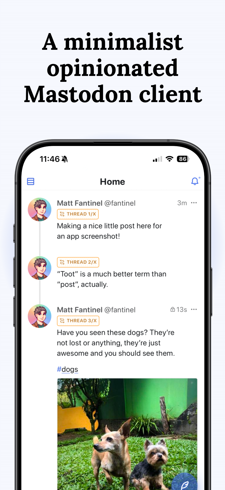
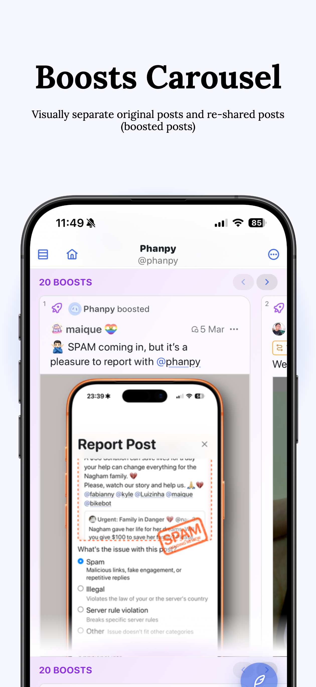
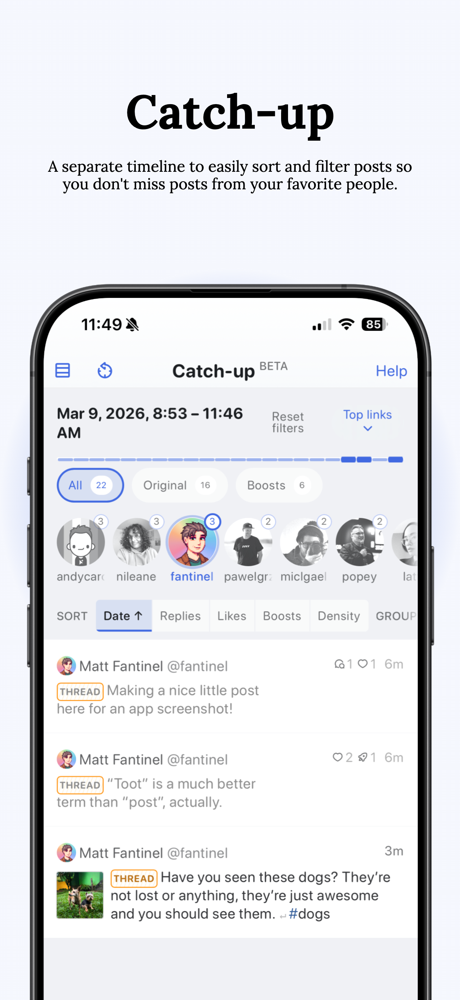

<div align="center">
  

iPhanpy
===

This is a fork of [Phanpy](https://phanpy.social), with the goal of making it installable as an iOS app.

In my experience, it offers better performance and less glitches than the installed web app (PWA).
</div>

<div align="center">
<a href="https://fantinel.dev/blog/iphanpy-mastodon-client"> Read blog post </a>

<a href="https://apps.apple.com/app/iphanpy-for-mastodon/id6755365082">Download (App Store)</a>
</div>

---

<div align="center">



</div>

## Installation

iPhanpy is available on the [App Store](https://apps.apple.com/app/iphanpy-for-mastodon/id6755365082), and also on AltStore PAL if you're in the EU or Japan.

### AltStore PAL

To install through AltStore PAL, copy and paste the URL below on your browser, which should automatically open AltStore and add the source:

```
altstore-pal://source?url=https://raw.githubusercontent.com/matfantinel/iphanpy/refs/heads/main/altstore/source.json
```

## About iPhanpy

iPhanpy is a fork of [Phanpy](https://phanpy.social), with the goal of making it installable as an iOS app.

It uses [Capacitor](https://capacitorjs.com/) to wrap the web app into a native app, and I did some tweaks to make it work on iOS. The tweaks so far are:

- Custom icon, built based on the original SVG and edited with Icon Composer, supporting Liquid Glass styles;
- Custom handling for instance authentication. This app listens for the "iphanpy://iphanpy" URL scheme to fetch the auth code;
- Added custom code to invoke the device's camera, so it asks for the needed permissions first;
- Intercepts all external links to open them in an in-app browser instead;


## Customization details

For details on what's been changed, check the [IPHANPY_CUSTOMIZATIONS.md](IPHANPY_CUSTOMIZATIONS.md) file.

## How to build / install through XCode

1. Clone this repository, or download it as a zip file;
2. Open the downloaded folder in a Terminal, and run `npm install`. NodeJS 20+ is required;
3. Run `npm run build && npx cap sync ios` to build the app;
4. Run `npx cap open ios` to open the project in XCode;
5. Inside XCode, you need to select "App" in the left sidebar, then on "Signing and Capabilities" --> "Team", select your own Personal Team;
6. Now, also inside XCode, you can just choose to run the app on your iPhone (and probably iPad). After running it once, the app will remain installed and you can use it for 7 days. **After 7 days, you'll have to re-install it through XCode again**.
